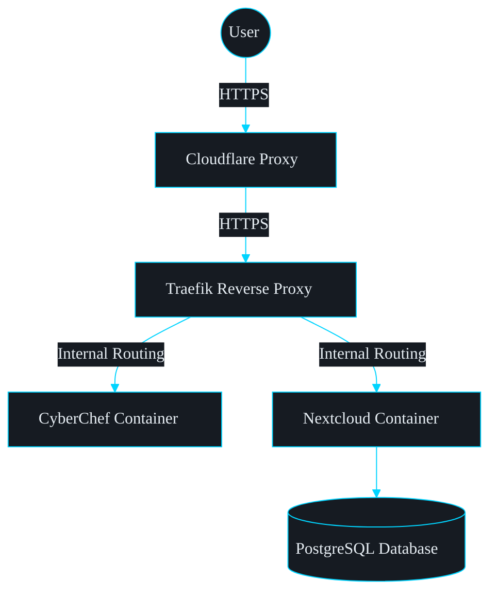
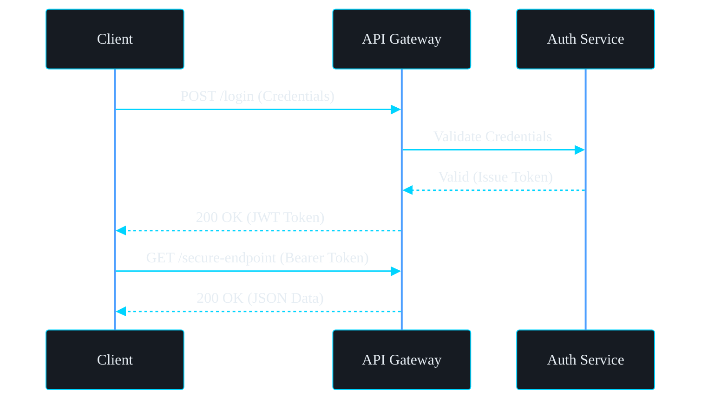
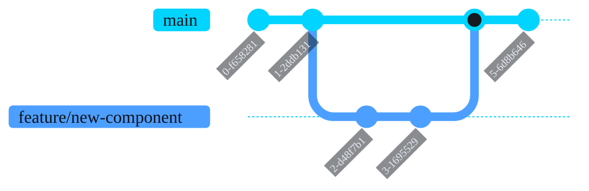

They say a picture is worth a thousand words, and nowhere is that more true than in software architecture and documentation. However, maintaining diagram files alongside code can be a hassle, especially when trying to version control them.

That's why I've natively integrated **Mermaid.js** into the blog. Mermaid allows you to generate beautiful flowchart, sequence, class, state, and other diagrams directly within your Markdown files using simple, version-controllable text!

Whether you are documenting a Homelab setup, Docker architecture, Cyber Security attack path, or software design, Mermaid makes creating and updating visual representations incredibly simple.

## 1. Flowcharts for Infrastructure

Flowcharts are excellent for visualizing network flows, container setups, or application components. Here is a basic flowchart showing a typical homelab web request:

## 2. Sequence Diagrams for Workflows

Sequence diagrams perfectly illustrate how different entities interact over time, making them ideal for explaining things like the OAuth PKCE flow or authentication handshakes:

## 3. Visualizing Git Branching Strategies

Explaining complex merge strategies? You can even draw Git branching histories natively:

## How to use it

If you're using this theme, rendering a diagram is effortless. Simply create a standard Markdown code block and use `mermaid` as the language tag. You don't need to import any scripts, upload images, or install any extensions—it renders perfectly on the page out of the box!
