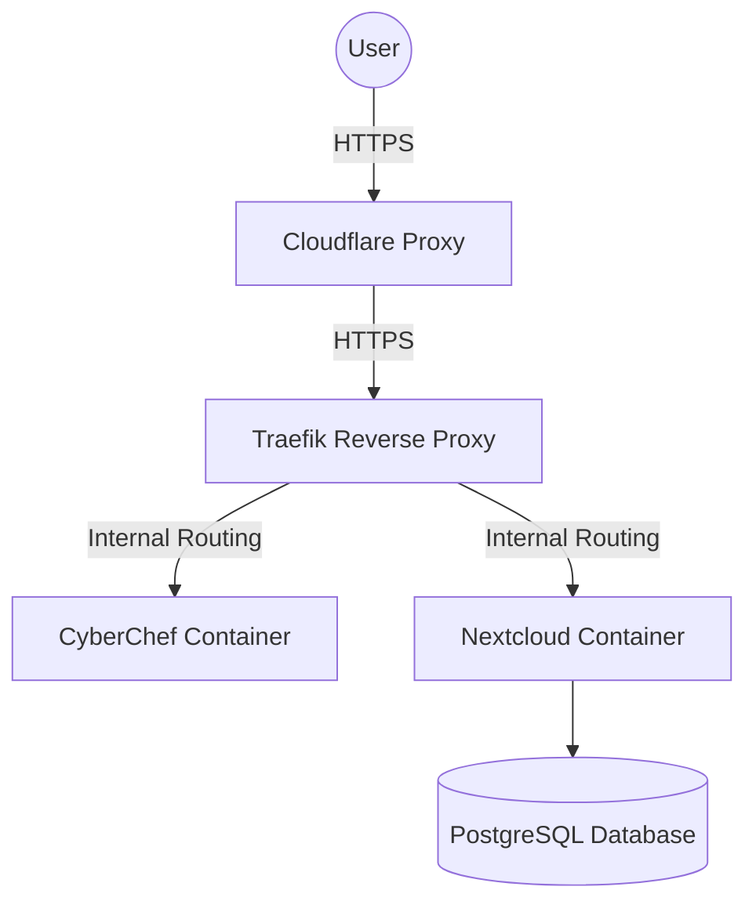
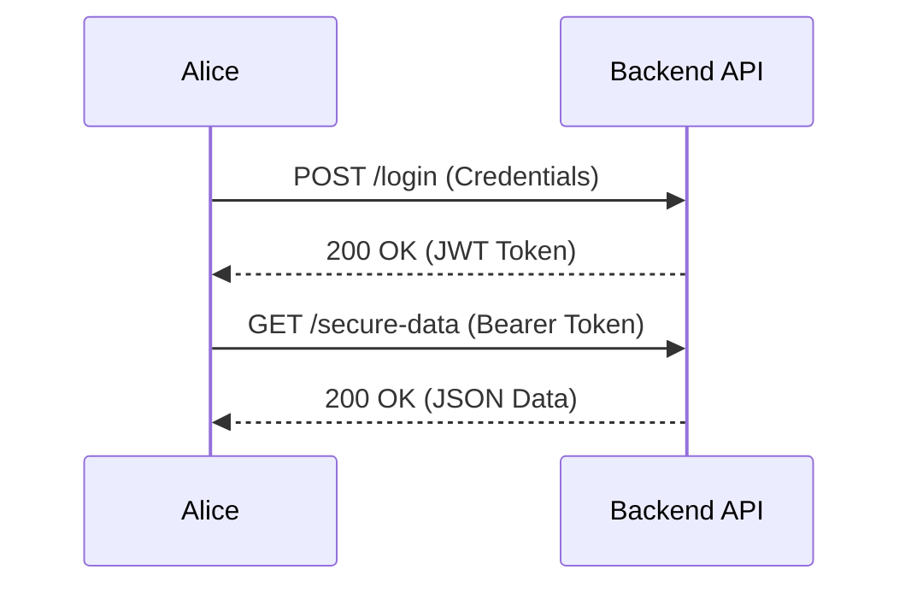
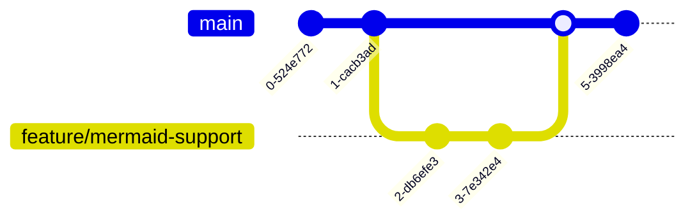

As part of the **Bleeding Edge** upgrades to the blog, we have natively integrated **Mermaid.js**. This allows you to generate beautiful flowchart, sequence, class, state, and other diagrams directly within your Markdown files using simple text.

This is incredibly useful for documenting Homelab setups, Docker architectures, or Cyber Security attack paths.

## 1. Simple Flowchart

Here is a basic flowchart showing a typical homelab web request:

## 2. Sequence Diagram

Sequence diagrams are perfect for explaining things like the OAuth PKCE flow or authentication handshakes:

## 3. Git Graph

You can even draw Git branching strategies natively:

## How to use it

To render a diagram, simply create a Markdown code block and use `mermaid` as the language. You don't need to import any scripts or install any extensions; it runs perfectly out of the box!
