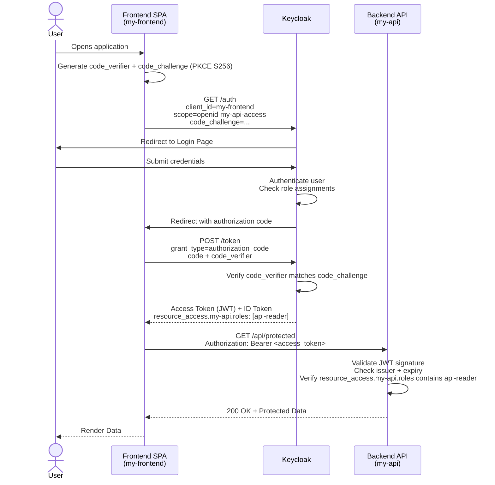

When securing a modern web application that has a **JavaScript frontend** talking to a **protected REST API**, you need two distinct Keycloak client configurations. A common mistake is reusing one client for both roles — this creates security gaps and blurs the trust boundaries in your architecture.

This post walks through the correct pattern: a **bearer-only resource server client** for the backend API, and a **PKCE public client** for the frontend, with role-based access wired together through a dedicated client scope.

---

## The Two-Client Pattern

The architecture is straightforward:

| Component | Keycloak Client Type | Access Type | Purpose |
| --------- | -------------------- | ----------- | ------- |
| Backend API | Bearer-only | Confidential | Validates incoming JWTs, never issues tokens |
| Frontend SPA | Public + PKCE | Public | Exchanges user credentials for tokens |

The backend **never participates in a login flow** — it only validates tokens. The frontend drives the entire OAuth2 Authorization Code flow with PKCE and receives a token that carries the roles the backend will check.

---

## Step 1: Create the Resource Server (Bearer-Only) Client

In the Keycloak Admin Console, navigate to your realm and create a new client for your backend API.

**Settings:**

- **Client ID:** `my-api`
- **Client authentication:** `On`
- **Authentication flow:** Disable *Standard flow*, *Direct access grants*, and all other flows

With all flows disabled, Keycloak will refuse to issue tokens for this client but will still validate incoming tokens — this is the modern equivalent of the old `bearer-only` access type.

### Create a Role on the Resource Server Client

Inside the `my-api` client, navigate to the **Roles** tab and create a role:

- **Role name:** `api-reader` (or whatever matches your API's access model)

This role represents the permission required to call your protected API endpoints.

---

## Step 2: Create the Frontend (PKCE Public) Client

Create a second client for your Single Page Application.

**Settings:**

- **Client ID:** `my-frontend`
- **Client authentication:** `Off` (Public — no client secret, safe for browser-based apps)
- **Authentication flow:** Enable *Standard flow* only
- **Valid redirect URIs:** `http://localhost:3000/*` (your SPA's origin)
- **Web origins:** `http://localhost:3000` (for CORS)

> Never enable *Direct access grants* (Resource Owner Password Credentials) on a public client facing the browser. This bypasses the consent and PKCE protections.
{: .prompt-warning }

### Enable PKCE

Under **Advanced Settings** for `my-frontend`:

- **Proof Key for Code Exchange Code Challenge Method:** `S256`

This forces the authorization code flow to require a `code_verifier` / `code_challenge` pair, preventing authorization code interception attacks in the browser.

---

## Step 3: Wire the Role via a Client Scope

Rather than directly assigning the `my-api:api-reader` role to users, create a **dedicated client scope** so the frontend token carries the role only when it's explicitly requested.

### Create the Client Scope

1. Go to **Client Scopes** → **Create client scope**
2. **Name:** `my-api-access`
3. **Type:** `Optional` (or `Default` if every user of this frontend should have it)
4. **Protocol:** `openid-connect`

### Add the Role Mapper to the Scope

Inside `my-api-access`, go to **Mappers** → **Configure a new mapper** → **User Client Role**:

- **Name:** `my-api-roles`
- **Client ID:** `my-api`
- **Token Claim Name:** `resource_access.my-api.roles` *(Keycloak's default structure)*
- **Add to ID token:** Off
- **Add to access token:** On
- **Add to userinfo:** Off

### Assign the Scope to the Frontend Client

Go back to `my-frontend` → **Client Scopes** → **Add client scope** → select `my-api-access`.

Now, when `my-frontend` requests the `my-api-access` scope during the authorization flow, the resulting access token will include the `api-reader` role under `resource_access.my-api.roles`.

---

## The Full Auth Flow

Here is the complete sequence from browser login to a protected API call:



---

## Token Claims: What the Backend Sees

When the backend receives the access token and decodes the JWT payload, it will find the role nested under `resource_access`:

```json
{
  "exp": 1710503000,
  "iat": 1710502700,
  "iss": "https://keycloak.example.com/realms/my-realm",
  "aud": "my-api",
  "sub": "a1b2c3d4-...",
  "scope": "openid my-api-access",
  "resource_access": {
    "my-api": {
      "roles": [
        "api-reader"
      ]
    }
  }
}
```

Your backend framework (Spring Security, Quarkus, FastAPI, etc.) can extract and enforce this role automatically. Most Keycloak adapters and OIDC libraries map `resource_access.<client-id>.roles` to a principal's granted authorities out of the box.

---

## Backend Validation Checklist

When your API validates an incoming token, it must verify:

- ✅ **Signature** — token is signed by your Keycloak realm's public key
- ✅ **Issuer (`iss`)** — matches your Keycloak realm URL
- ✅ **Audience (`aud`)** — contains `my-api`
- ✅ **Expiry (`exp`)** — token has not expired
- ✅ **Role** — `resource_access.my-api.roles` contains the required role

> **Never skip audience validation.** Without it, a token issued for a completely different client could be replayed against your API.
{: .prompt-warning }

---

## Why Not One Client for Both?

A common shortcut is to set up a single confidential client and use it for both the frontend and the backend. This causes several problems:

- The **client secret leaks into the browser** if used by the SPA
- The backend would need to participate in token issuance (not its job)
- PKCE cannot be combined with `bearer-only` in a single client
- Role management becomes a tangled mess as the app grows

Keeping clients separated gives you clear trust boundaries: the **public PKCE client owns authentication**, the **bearer-only client owns authorization**. Each does one thing well.

---

## Summary

| Task | Where |
| ---- | ----- |
| Define the permission (role) | `my-api` → Roles tab |
| Bundle the role into a token claim | `my-api-access` scope → User Client Role mapper |
| Expose the scope to the browser app | `my-frontend` → Client Scopes |
| Force PKCE for the SPA | `my-frontend` → Advanced → Code Challenge Method: S256 |
| Validate the token on every request | Backend API — signature, issuer, audience, role |

This two-client pattern scales cleanly. When you add a second frontend (mobile app, another SPA), you create a new public client, add the same `my-api-access` scope, and the role wiring just works — no changes needed to the resource server client or the backend code.
