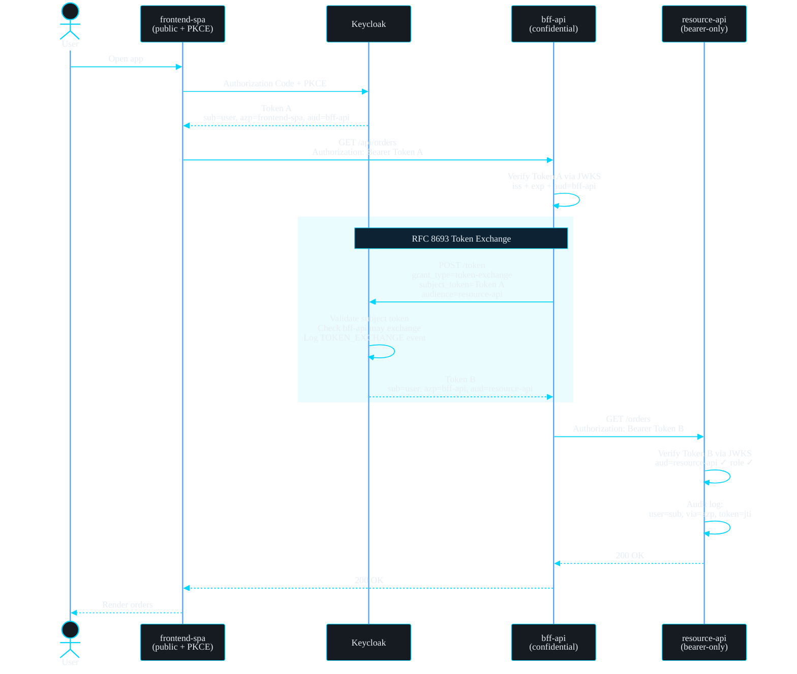

In [the previous Keycloak post](/posts/keycloak-bearer-only-and-pkce-client-setup/) we wired up a frontend SPA directly to a resource API. That works for two tiers — but most real architectures have three: a **frontend**, a **BFF (Backend-for-Frontend) API**, and one or more **resource APIs** behind it.

The lazy solution is to let the BFF forward the frontend's token straight to the resource API. It works, but it destroys two things you care about:

1. **Audience isolation** — the frontend's token was minted for the BFF. If the resource API accepts it, any leaked frontend token can hit every downstream API directly.
2. **Auditability** — the resource API has no idea the BFF was in the chain. Your audit log says "user X called us" when the truth is "the BFF called us *on behalf of* user X".

The fix is **OAuth 2.0 Token Exchange ([RFC 8693](https://datatracker.ietf.org/doc/html/rfc8693))** — officially supported in Keycloak since [version 26.2](https://www.keycloak.org/2025/05/standard-token-exchange-kc-26-2). The BFF trades the frontend token for a *new* token scoped to the resource API, and every hop becomes visible in the token itself and in Keycloak's event log.

---

## The Three-Client Architecture

| Component | Keycloak Client | Type | Token role |
| --------- | --------------- | ---- | ---------- |
| SPA in the browser | `frontend-spa` | Public + PKCE | Obtains the user token (`aud: bff-api`) |
| BFF / UX API | `bff-api` | Confidential | Validates the user token, **exchanges** it (`aud: resource-api`) |
| Resource API | `resource-api` | Bearer-only | Validates the exchanged token, enforces roles, writes audit logs |

Each token in the chain is valid for **exactly one hop**. A frontend token replayed against the resource API fails audience validation. An exchanged token replayed against the BFF fails the same way. That is the whole point.

> Keycloak's standard token exchange is **internal-to-internal**: both the subject token and the exchanged token live in the same realm. Cross-realm and external IdP exchange are a different (legacy/preview) feature — don't mix them up.
{: .prompt-info }

---

## What the Exchange Actually Changes

The exchanged token keeps the **user identity** but swaps the **acting client** and **audience**:

| Claim | Frontend token | Exchanged token | Meaning |
| ----- | -------------- | --------------- | ------- |
| `sub` | `a1b2c3d4-…` | `a1b2c3d4-…` *(unchanged)* | The human never disappears from the chain |
| `azp` | `frontend-spa` | `bff-api` | Which client is *acting* right now |
| `aud` | `bff-api` | `resource-api` | Which API may accept this token |
| `jti` | `7f3a…` | `9c1e…` *(new)* | Unique ID → correlate with Keycloak's event log |

This is what makes the pattern auditable: the resource API logs `sub` + `azp` and can answer *"who did what, through which client, with which token"* — and Keycloak independently records the exchange event server-side.

---

## Keycloak Setup (26.2+)

### Step 1: The Frontend Client (`frontend-spa`)

Same recipe as [last time](/posts/keycloak-bearer-only-and-pkce-client-setup/):

- **Client authentication:** `Off` (public)
- **Authentication flow:** *Standard flow* only
- **Advanced → PKCE Code Challenge Method:** `S256`
- **Valid redirect URIs / Web origins:** your SPA origin

The frontend token must carry `aud: bff-api`. The cleanest way: go to `frontend-spa` → **Client scopes** → **Dedicated** tab → **Add mapper → Audience**, and pick `bff-api` as *Included Client Audience*.

### Step 2: The BFF Client (`bff-api`)

This is where the new toggle lives:

- **Client authentication:** `On` (confidential — you get a client secret)
- **Authentication flow:** disable *Standard flow* and *Direct access grants* — the BFF never logs users in
- **Capability config → Standard token exchange:** `On` ← *the magic switch*

### Step 3: The Resource Client (`resource-api`)

Classic bearer-only:

- **Client authentication:** `On`
- **Authentication flow:** everything `Off`
- **Roles tab:** create `order-reader`

### Step 4: Wire the Audience and Roles

For the exchange to mint a token with `aud: resource-api` *and* the user's roles, the BFF needs that audience in its scope:

1. Go to `bff-api` → **Client scopes** → **Dedicated** tab
2. **Assign role** → *Filter by clients* → select `resource-api` / `order-reader`

Then manage access by group, exactly as before:

- [x] Create group `order-readers`
- [x] Assign `resource-api` / `order-reader` to the group (Role mapping)
- [x] Add users to the group

### Step 5: Turn On Event Logging

**Realm settings → User events → Save events: `On`.** Every exchange now produces a `TOKEN_EXCHANGE` event recording the requesting client, the user, and the requested audience. This is your server-side audit trail — independent of anything your APIs log.

---

## The Full Flow



Two independent audit records come out of one request: Keycloak's `TOKEN_EXCHANGE` event and the resource API's own log line — linkable through the user ID and the token's `jti`.

---

## Demo

### Run Keycloak

```yaml
# docker-compose.yml
services:
  keycloak:
    image: quay.io/keycloak/keycloak:26.2
    command: start-dev
    environment:
      KC_BOOTSTRAP_ADMIN_USERNAME: admin
      KC_BOOTSTRAP_ADMIN_PASSWORD: admin
    ports:
      - "8080:8080"
```

### The Exchange, Raw

Before writing any code, you can watch the exchange happen with plain `curl`:

```bash
curl -s -X POST \
  "http://localhost:8080/realms/demo/protocol/openid-connect/token" \
  -d "grant_type=urn:ietf:params:oauth:grant-type:token-exchange" \
  -d "client_id=bff-api" \
  -d "client_secret=${BFF_CLIENT_SECRET}" \
  -d "subject_token=${FRONTEND_ACCESS_TOKEN}" \
  -d "subject_token_type=urn:ietf:params:oauth:token-type:access_token" \
  -d "requested_token_type=urn:ietf:params:oauth:token-type:access_token" \
  -d "audience=resource-api"
```

The response contains a brand-new `access_token` plus `"issued_token_type": "urn:ietf:params:oauth:token-type:access_token"` — that's Token B from the diagram.

### The BFF: Validate, Exchange, Forward

Both services use [`jose`](https://github.com/panva/jose) and its `createRemoteJWKSet` — it fetches Keycloak's **JWKS endpoint** (`/protocol/openid-connect/certs`) once, caches the keys, and transparently re-fetches when Keycloak rotates them. No hardcoded public keys, no restart on key rollover.

```js
// bff/server.js
import express from "express";
import { createRemoteJWKSet, jwtVerify } from "jose";

const KC = "http://localhost:8080/realms/demo";
const JWKS = createRemoteJWKSet(new URL(`${KC}/protocol/openid-connect/certs`));

const app = express();

// 1. Validate the incoming frontend token — audience MUST be bff-api
async function authenticate(req, res, next) {
  try {
    const token = req.headers.authorization?.replace("Bearer ", "");
    const { payload } = await jwtVerify(token, JWKS, {
      issuer: KC,
      audience: "bff-api",
    });
    req.user = payload;
    req.subjectToken = token;
    next();
  } catch {
    res.status(401).json({ error: "invalid_token" });
  }
}

// 2. Trade it for a resource-api token (RFC 8693)
async function exchangeToken(subjectToken) {
  const response = await fetch(`${KC}/protocol/openid-connect/token`, {
    method: "POST",
    headers: { "Content-Type": "application/x-www-form-urlencoded" },
    body: new URLSearchParams({
      grant_type: "urn:ietf:params:oauth:grant-type:token-exchange",
      client_id: "bff-api",
      client_secret: process.env.BFF_CLIENT_SECRET,
      subject_token: subjectToken,
      subject_token_type: "urn:ietf:params:oauth:token-type:access_token",
      requested_token_type: "urn:ietf:params:oauth:token-type:access_token",
      audience: "resource-api",
    }),
  });
  if (!response.ok) throw new Error(`exchange failed: ${response.status}`);
  return (await response.json()).access_token;
}

// 3. Call the resource API with the exchanged token — never with Token A
app.get("/api/orders", authenticate, async (req, res) => {
  const exchanged = await exchangeToken(req.subjectToken);
  const upstream = await fetch("http://localhost:4000/orders", {
    headers: { Authorization: `Bearer ${exchanged}` },
  });
  res.status(upstream.status).json(await upstream.json());
});

app.listen(3001);
```

### The Resource API: Validate and Audit

```js
// resource/server.js
import express from "express";
import { createRemoteJWKSet, jwtVerify } from "jose";

const KC = "http://localhost:8080/realms/demo";
const JWKS = createRemoteJWKSet(new URL(`${KC}/protocol/openid-connect/certs`));

const app = express();

app.get("/orders", async (req, res) => {
  try {
    const token = req.headers.authorization?.replace("Bearer ", "");
    const { payload } = await jwtVerify(token, JWKS, {
      issuer: KC,
      audience: "resource-api", // frontend tokens die here
    });

    const roles = payload.resource_access?.["resource-api"]?.roles ?? [];
    if (!roles.includes("order-reader")) {
      return res.status(403).json({ error: "insufficient_role" });
    }

    // The audit line: WHO did WHAT through WHICH client
    console.log(JSON.stringify({
      audit: "orders.read",
      user: payload.sub,   // the human
      via: payload.azp,    // "bff-api" — the acting client
      token: payload.jti,  // correlate with Keycloak's TOKEN_EXCHANGE event
      at: new Date().toISOString(),
    }));

    res.json([{ id: 1, item: "demo order" }]);
  } catch {
    res.status(401).json({ error: "invalid_token" });
  }
});

app.listen(4000);
```

<details markdown="1">
<summary>What an audit line + Keycloak event pair looks like</summary>

Resource API log:

```json
{
  "audit": "orders.read",
  "user": "a1b2c3d4-e5f6-7890-abcd-ef1234567890",
  "via": "bff-api",
  "token": "9c1e4f22-8b3d-4a17-b2e9-d4f6a8c01e35",
  "at": "2026-06-09T10:14:32.118Z"
}
```

Keycloak event (Admin Console → Realm settings → Events → User events):

```json
{
  "type": "TOKEN_EXCHANGE",
  "clientId": "bff-api",
  "userId": "a1b2c3d4-e5f6-7890-abcd-ef1234567890",
  "details": {
    "audience": "resource-api",
    "grant_type": "urn:ietf:params:oauth:grant-type:token-exchange",
    "subject_token_type": "urn:ietf:params:oauth:token-type:access_token"
  }
}
```

Same user, same client, independently recorded on both sides of the trust boundary.

</details>

> RFC 8693 also defines an `act` (actor) claim for delegation chains. Keycloak's internal exchange expresses the acting party through `azp` instead — if you need an explicit `act` claim, add a protocol mapper. For multi-hop chains (resource API calling *another* API), look at [identity chaining in Keycloak 26.5+](https://www.keycloak.org/2026/01/jwt-authorization-grant).
{: .prompt-tip }

---

## Why Not Just Forward the Frontend Token?

| | Pass-through | Token exchange |
| --- | --- | --- |
| Resource API audience check | ❌ must accept `aud: bff-api` (or skip the check) | ✅ strict `aud: resource-api` |
| Leaked frontend token blast radius | ❌ every downstream API | ✅ BFF only |
| Resource API knows the acting client | ❌ sees `azp: frontend-spa` | ✅ sees `azp: bff-api` |
| Server-side audit event per hop | ❌ nothing | ✅ `TOKEN_EXCHANGE` in Keycloak |
| Scope narrowing per downstream API | ❌ all-or-nothing | ✅ `scope` param on exchange |

> If your resource API currently "works" with the frontend's token, that is not a feature — it means audience validation is missing or too loose. That is the exact gap that turns one stolen token into full lateral movement.
{: .prompt-warning }

---

## Validation Checklist

Every service in the chain verifies its own hop:

- ✅ **Signature** — via the realm's **JWKS endpoint**, with automatic key rotation
- ✅ **Issuer (`iss`)** — matches the realm URL
- ✅ **Audience (`aud`)** — `bff-api` at the BFF, `resource-api` at the resource API
- ✅ **Expiry (`exp`)** — exchanged tokens get their own (short) lifetime
- ✅ **Role** — `resource_access.resource-api.roles` contains `order-reader`
- ✅ **Audit** — log `sub` + `azp` + `jti` on every protected call

---

## Summary

| Task | Where |
| ---- | ----- |
| Frontend gets `aud: bff-api` | `frontend-spa` → Dedicated scope → Audience mapper |
| Enable the exchange | `bff-api` → Capability config → **Standard token exchange** |
| Exchanged token gets audience + roles | `bff-api` → Dedicated scope → assign `resource-api/order-reader` |
| Server-side audit trail | Realm settings → User events → Save events |
| Key rotation without redeploys | Both APIs validate via the JWKS endpoint |
| Per-hop authorization | Strict `aud` checks on every service |

One realm, three clients, two tokens, and a complete answer to *"who did what, through which client, when"* — on both sides of the trust boundary.

---

## Sources

- [Standard Token Exchange is now officially supported in Keycloak 26.2 – Keycloak](https://www.keycloak.org/2025/05/standard-token-exchange-kc-26-2)
- [Configuring and using token exchange – Keycloak docs](https://www.keycloak.org/securing-apps/token-exchange)
- [RFC 8693 – OAuth 2.0 Token Exchange](https://datatracker.ietf.org/doc/html/rfc8693)
- [JWT Authorization Grant and Identity Chaining in Keycloak 26.5 – Keycloak](https://www.keycloak.org/2026/01/jwt-authorization-grant)
- [jose – JavaScript module for JWTs and JWKS](https://github.com/panva/jose)
- [Keycloak Client Setups: Bearer-Only Resource Server + PKCE Frontend Client](/posts/keycloak-bearer-only-and-pkce-client-setup/)
